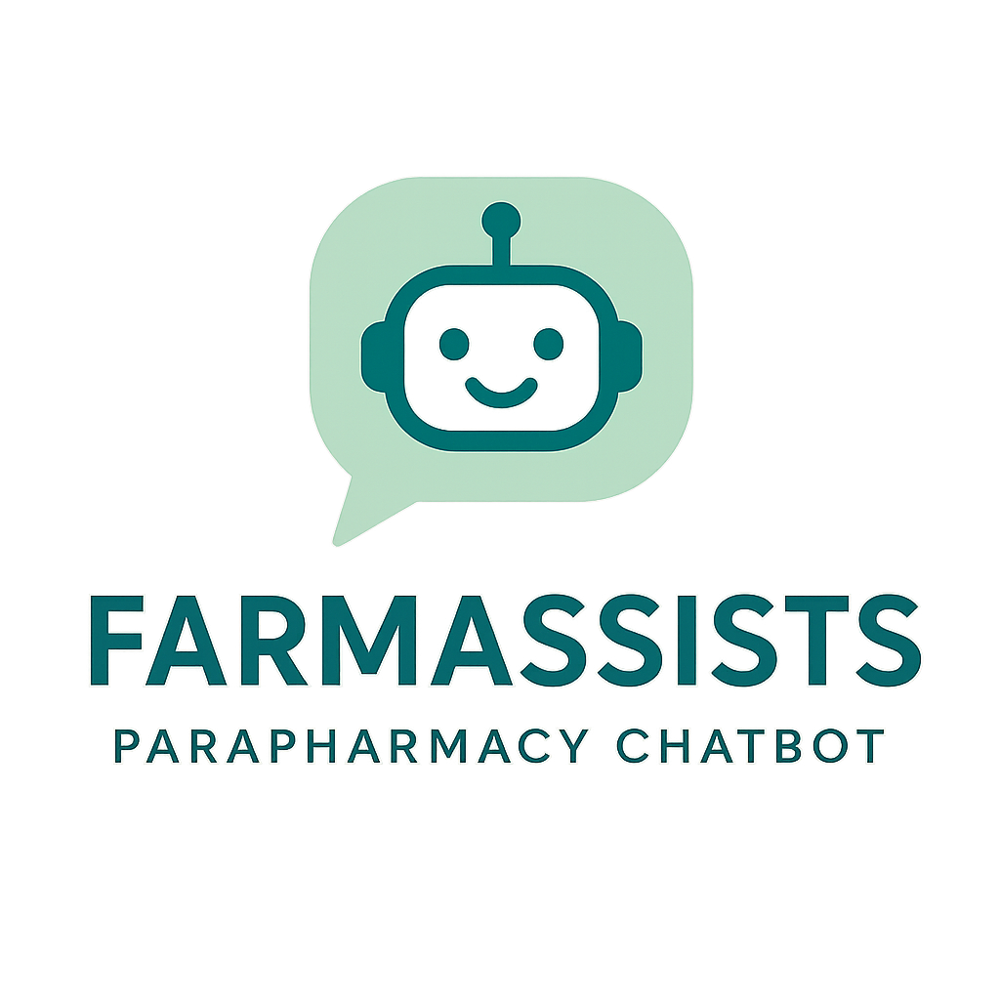
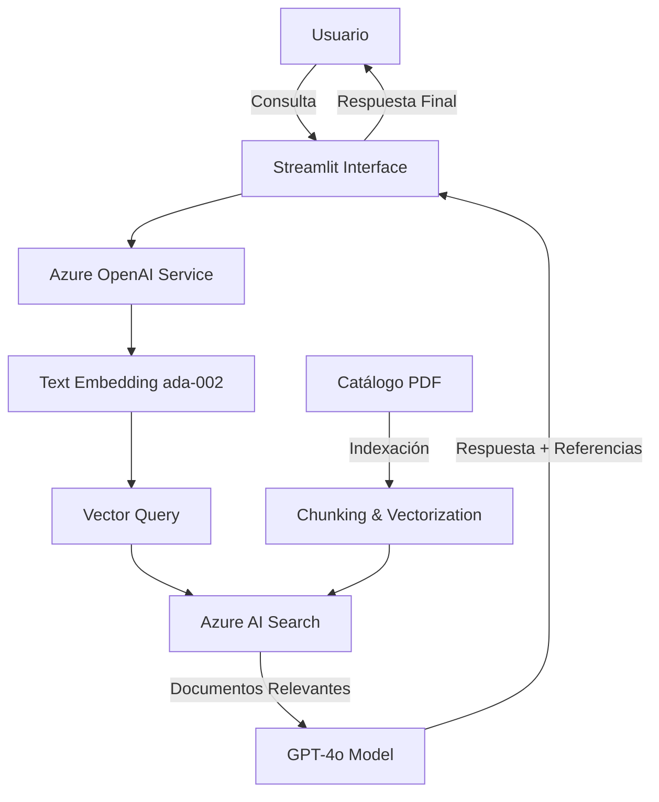
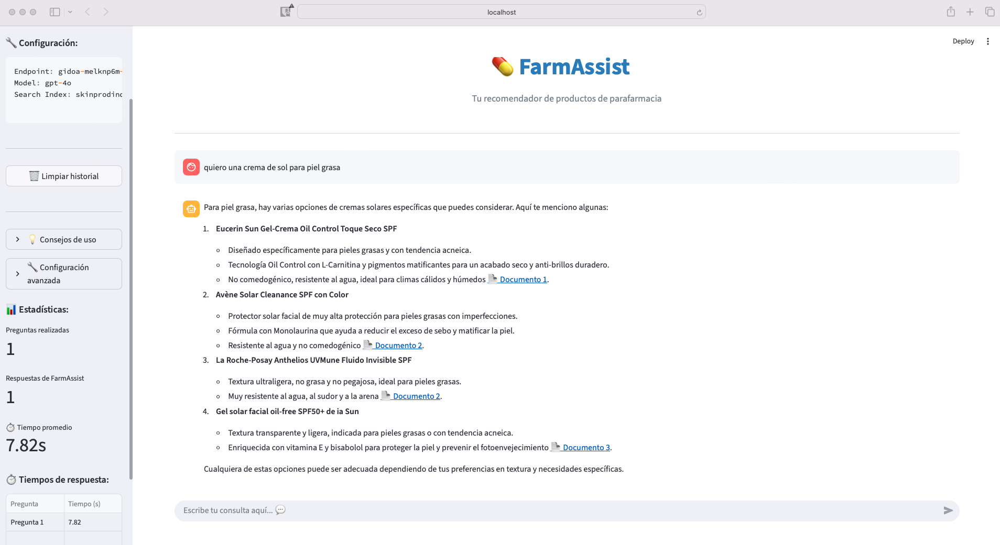

# FarmAssist

<p align="center">
   
</p>
<p align="center">
   <strong>Asistente virtual inteligente para productos de parafarmacia</strong>
</p>

<p align="center">
  
  
  
  
  
</p>

---

## Tabla de Contenidos

- [Descripción](#descripción)
- [Características Principales](#características-principales)
- [Arquitectura](#arquitectura)
- [Requisitos](#requisitos)
- [Instalación](#instalación)
- [Configuración](#configuración)
- [Uso](#uso)
- [Capturas de Pantalla](#capturas-de-pantalla)
- [Tecnologías](#tecnologías)
- [Análisis Económico](#análisis-económico)
- [Áreas de Mejora](#áreas-de-mejora)


---

## Descripción

FarmAssist es un **asistente virtual conversacional** especializado en productos de parafarmacia, desarrollado como parte del Trabajo Fin de Máster (TFM): **FarmAssist: Bot Conversacional para Recomendación Personalizada de Productos de Parafarmacia**. 
La solución implementa una arquitectura RAG (Retrieval-Augmented Generation) que combina modelos de lenguaje grandes (LLM) con capacidades avanzadas de búsqueda semántica.

### Objetivo Principal

Optimizar la interacción con el cliente en el sector de la parafarmacia mediante un sistema conversacional que:
- Proporciona recomendaciones precisas y contextualizadas
- Accede a información actualizada del catálogo de productos
- Mantiene conversaciones naturales con terminología especializada
- Garantiza respuestas basadas en información verificable

---

## Características Principales

### Inteligencia Conversacional
- **Comprensión de lenguaje natural** adaptado al dominio farmacéutico
- **Contexto persistente** durante toda la conversación
- **Interpretación de consultas** con terminología técnica y coloquial
- **Recomendaciones personalizadas** basadas en síntomas y necesidades

### Búsqueda Semántica Avanzada
- **Vectorización de documentos** con text-embedding-ada-002
- **Búsqueda híbrida** (vector + semántica + keyword)
- **Indexación optimizada** de fichas técnicas de productos
- **Referencias documentales** automáticas con enlaces

### Métricas y Análisis
- **Tiempos de respuesta** en tiempo real
- **Estadísticas de conversación** detalladas
- **Historial de interacciones** persistente
- **Monitoreo de rendimiento** integrado

---

## Arquitectura



### Flujo Operativo

1. **Fase de Indexación**: Los documentos PDF son fragmentados (chunking) y vectorizados usando embeddings
2. **Fase de Consulta**: Las preguntas del usuario se vectorizan y se buscan documentos similares
3. **Fase de Generación**: GPT-4o genera respuestas contextualizadas usando los documentos recuperados

---

## Requisitos

### Requisitos del Sistema
- **Python**: 3.8 o superior
- **Conexión a Internet**: Para servicios Azure
- **Memoria RAM**: Mínimo 4GB recomendado

### Servicios Azure Requeridos
- **Azure OpenAI Service**: Con deployment de GPT-4o y text-embedding-ada-002
- **Azure AI Search**: Con índice configurado para documentos PDF
- **Cuenta Azure**: Con suscripción activa

---

## Instalación

### 1. Clonar el Repositorio
```bash
git clone https://github.com/dirsta4p/FarmAssists.git
cd FarmAssists
```

### 2. Crear Entorno Virtual
```bash
python -m venv farmassist_env
source farmassist_env/bin/activate  # En Windows: farmassist_env\Scripts\activate
```

### 3. Instalar Dependencias
```bash
pip install -r requirements.txt
```

---

## Configuración

### Variables de Entorno

> **Importante**: Nunca subas las API keys al repositorio público

Crea un archivo `.env` en la raíz del proyecto:

```env
AZURE_OPENAI_ENDPOINT=https://tu-endpoint.openai.azure.com/
AZURE_OPENAI_KEY=tu_api_key_aqui
AZURE_OPENAI_DEPLOYMENT=gpt-4o
AZURE_SEARCH_ENDPOINT=https://tu-search.search.windows.net
AZURE_SEARCH_KEY=tu_search_key_aqui
AZURE_SEARCH_INDEX=skinprodindex
```

### Configuración del Deployment

1. **Azure OpenAI Service**:
   - Deployment: `gpt-4o`
   - Embedding Model: `text-embedding-ada-002`
   - API Version: `2025-01-01-preview`

2. **Azure AI Search**:
   - Query Type: `vector_semantic_hybrid`
   - Top Documents: `5`
   - Semantic Configuration: `default`

---

## Uso

### Ejecutar la Aplicación
```bash
streamlit run chatbot.py
```

La aplicación estará disponible en: `http://localhost:8501`

### Ejemplos de Consultas

```
"¿Tienes champús para cabello graso?"
"quiero una crema de sol para piel grasa"
"Recomiéndame algo para piel seca"
"¿Qué productos tienes para el acné?"
"¿Hay contraindicaciones en este producto?"
```

---

## Capturas de Pantalla



---

## Tecnologías

| Tecnología | Versión | Propósito |
|------------|---------|-----------|
| **Python** | 3.8+ | Lenguaje base |
| **Streamlit** | 1.28.0+ | Framework web |
| **Azure OpenAI** | API 2025-01-01 | Modelo de lenguaje |
| **Azure AI Search** | - | Búsqueda semántica |
| **OpenAI Python SDK** | 1.0.0+ | Cliente API |
| **Pandas** | - | Análisis de datos |

### Modelos Utilizados
- **GPT-4o**: Generación de respuestas conversacionales
- **GPT-4**: Generación de respuestas conversacionales
- **text-embedding-ada-002**: Vectorización de documentos y consultas

---

## Análisis Económico

### Costes Operativos Estimados

| Componente | Coste Mensual* | Descripción |
|------------|----------------|-------------|
| Azure OpenAI (GPT-4o) | ~€50-150 | Basado en 1000 consultas/mes |
| Azure AI Search | ~€30-80 | Tier básico/estándar |
| Embedding ada-002 | ~€5-15 | Vectorización de documentos |
| **Total Estimado** | **€85-245/mes** | Para pequeña farmacia |

*Precios orientativos sujetos a variación según uso real

---

## Áreas de Mejora
- Tests automatizados
- Soporte multiidioma
- Dashboard de analytics
- Autenticación de usuarios
- API REST independiente

---

<p align="center">
  <a href="#farmassist-">Volver al inicio</a>
</p>